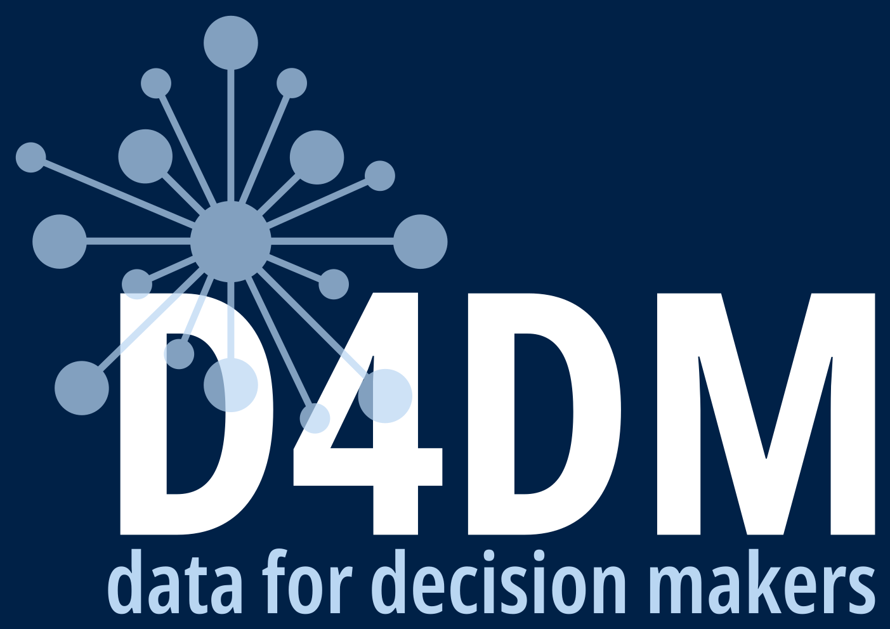

# Data for Decision Makers: Data Concepts and Applications Course Handbook 

<!-- badges: start -->

<!-- badges: end -->

This repository contains code and text for the Data for Decision Makers: Data Concepts and Applications course presentations.

