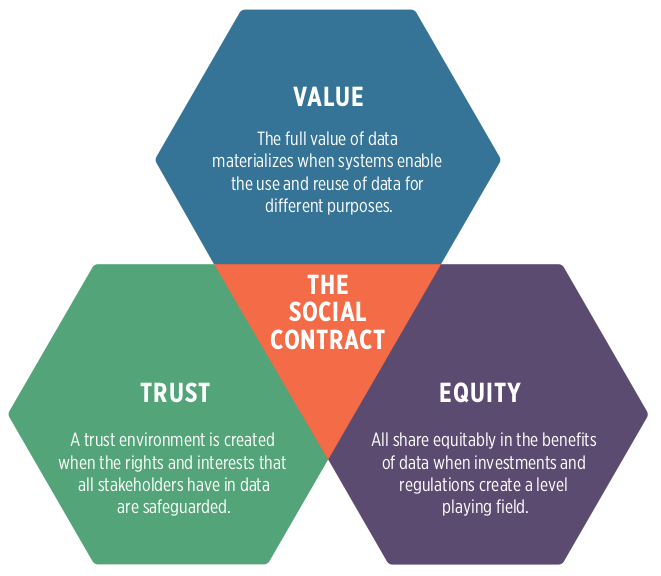
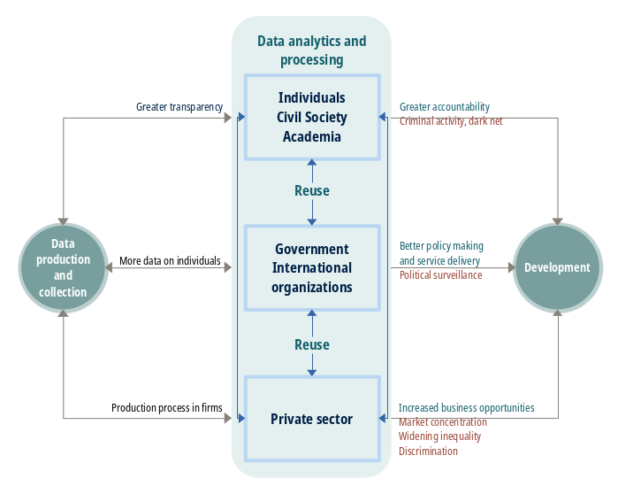
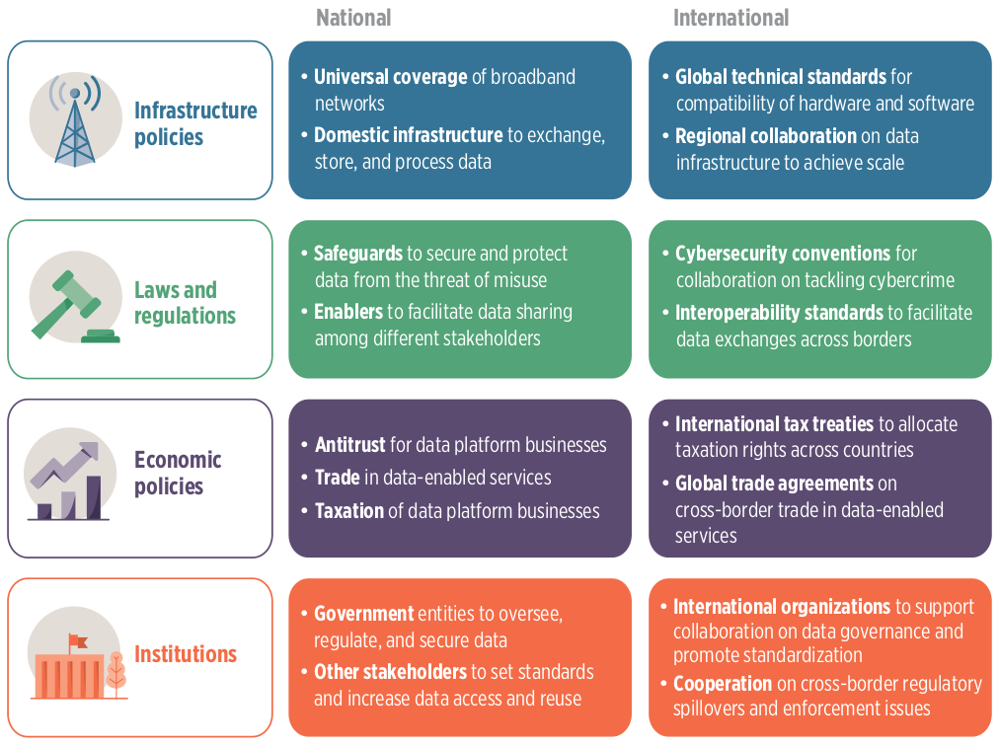
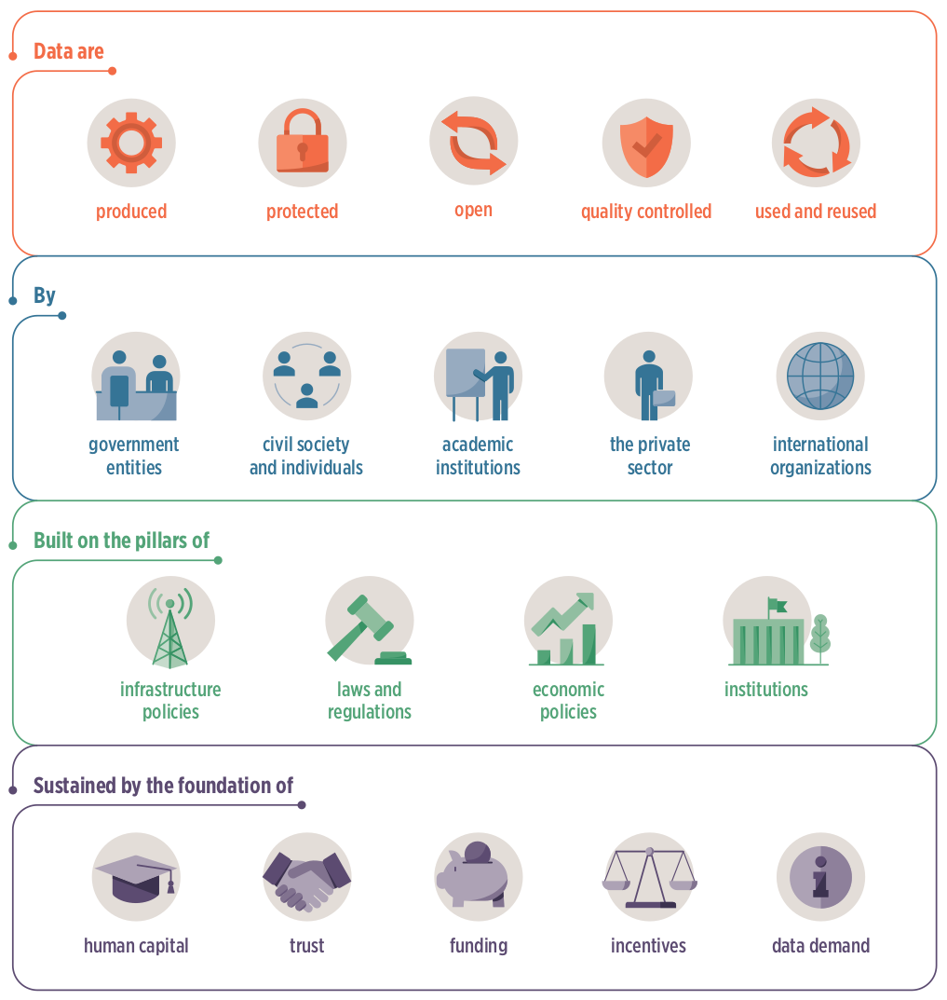
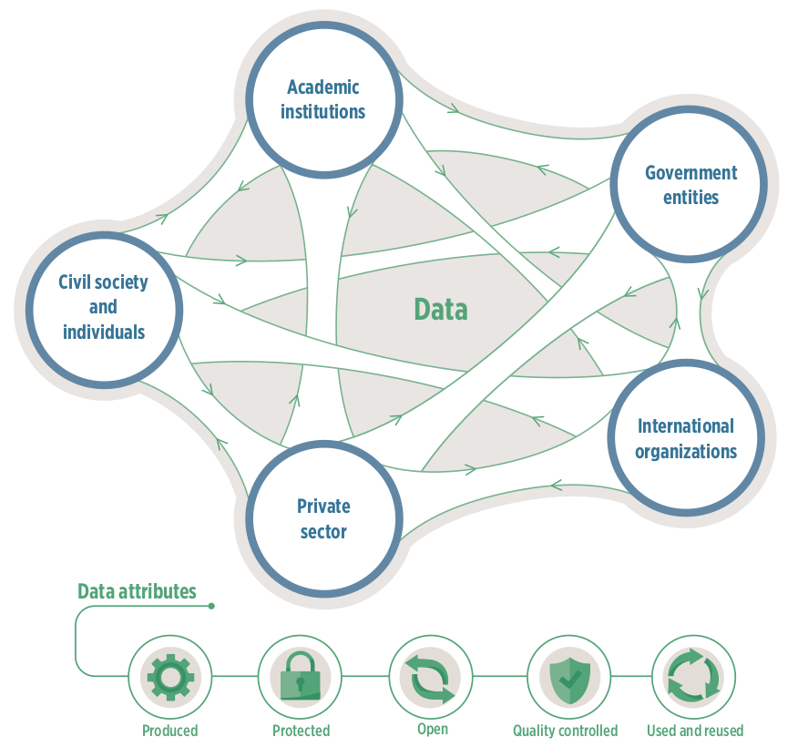
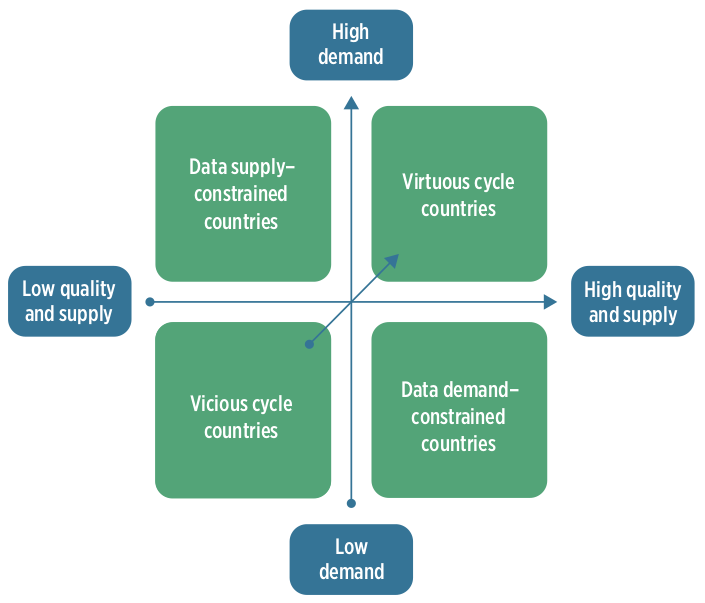
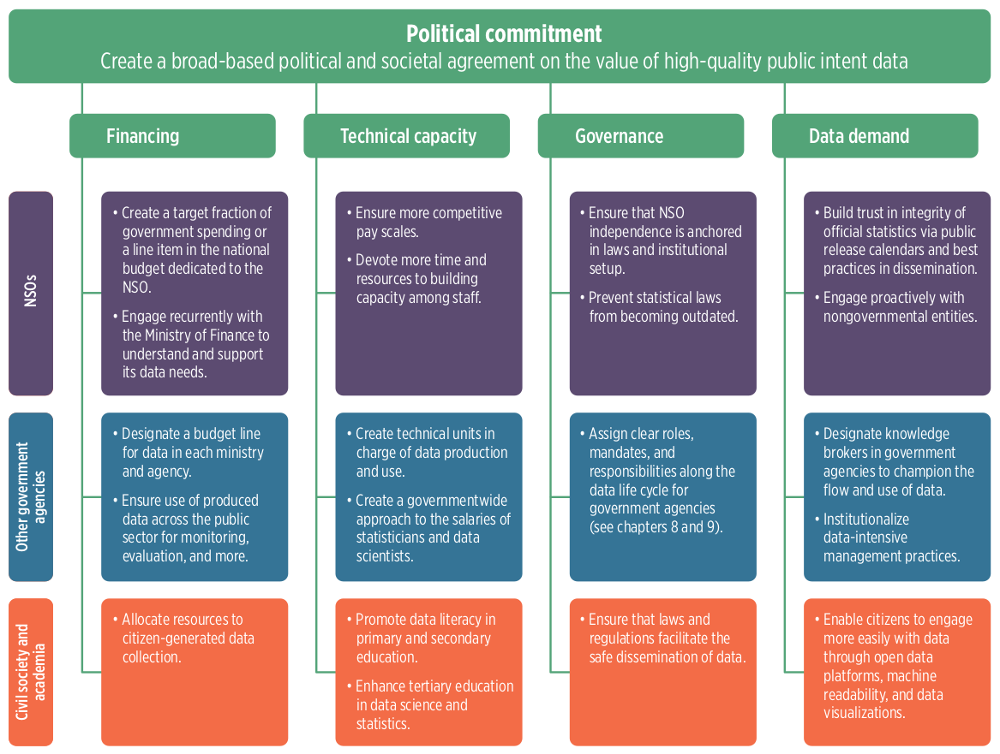

## National level policy and strategy on data governance lays the foundation {.center background-color="#002147"}

## Social contract for data {.center}

{fig-align="center"}

::: {.notes}

The figure presents a **social contract for data** built on three connected principles: **value, trust, and equity**. Data create value when systems allow them to be used and reused for different purposes. Trust depends on protecting the rights and interests of everyone involved, while equity requires the benefits of data to be shared fairly.

Such a social contract establishes common expectations among those who create, share, and reuse data. It seeks to ensure that people are protected from harm and receive a fair share of the benefits generated. Laws, regulations, institutions, and technical safeguards help establish and enforce these expectations.

The need for this approach is both national and international because data frequently cross borders. Lower-income countries may be disadvantaged by limited infrastructure, skills, regulatory capacity, and influence in global data markets. Effective data governance must therefore reflect local contexts while supporting global cooperation, safe data use, public trust, and more equitable development.

:::

## Theory of change: data for development {.center}

{fig-align="center" height="500px"}

::: {.notes}

The figure illustrates how data can contribute to development while also creating risks of misuse at different points in the data ecosystem. When data flow through government institutions, they may be used for political surveillance or discriminatory practices based on characteristics such as ethnicity, religion, race, gender, disability, or sexual orientation. When data are held or exchanged by individuals and civil society, cybercriminals may steal, alter, or exploit sensitive information. Hidden online networks can further enable illegal markets involving drugs, counterfeit money, stolen property, payment-card data, forged documents, weapons, and other illicit goods.

Risks also arise through the private sector. Companies may use detailed information about consumer preferences and behaviour to conduct highly targeted, manipulative marketing or to deploy algorithms that support unfair coordination among firms. The figure therefore highlights a central tension in data governance: the same data-sharing and reuse pathways that can improve transparency, accountability, public services, and economic opportunity can also enable surveillance, cybercrime, discrimination, and market abuse.

:::

## Data governance layers {.center}

{fig-align="center"}

::: {.notes}

To maximise the impact of public intent data on development, governments need to address the financing, technical capacity, governance, and data demand roadblocks. This figure summarises some of the main policies governments can enact, categorised by the actors and barriers they primarily address.

:::

## Integrated national data system {.center}

{fig-align="center"}

::: {.notes}

The figure presents an **integrated national data system (INDS)** in which data are produced, protected, quality controlled, opened, and reused by government, civil society, academia, the private sector, and international organizations. A strong data governance framework provides the “rules of the road,” while the INDS acts as the infrastructure that allows data to move securely and efficiently among participants.

The system depends on four main pillars: infrastructure policies, laws and regulations, economic policies, and effective institutions. These are supported by essential foundations such as human capital, trust, funding, appropriate incentives, and sustained demand for data. Together, these elements help ensure that data use reflects social values, protects individual rights, and supports accountability.

Greater participation and integration increase the potential value of data because information can be reused across more institutions and for more purposes. However, this also requires shared standards, interoperability, close coordination, privacy safeguards, and clear responsibilities for data production, access, and use.

Countries will reach this goal at different speeds. Early priorities include strengthening governance policies, technical capacity, statistical institutions, and data literacy. More mature systems can focus on secure data exchange, common standards, and shared governance across sectors. Although there is no single model for every country, a successful INDS connects stakeholders, integrates diverse data sources, and enables data to flow safely in support of better decisions and development.

:::

## Data flow {.center}

{fig-align="center"}

::: {.notes}

Bringing the Elements Together: Building an Integrated National Data System

An effective data governance framework brings infrastructure, legislation, regulation, policy, and institutions into a coherent system. Its purpose is to ensure that data are managed and used in ways that reflect the country’s social contract for data.

The framework establishes clear rules and accountability mechanisms for the safe use, reuse, and sharing of data among government agencies, international organizations, civil society, individuals, academic institutions, and private-sector organizations. To unlock the full value of data, these arrangements must be supported by an integrated national data system that protects data transactions while also enabling appropriate and equitable access for all stakeholders.

:::

## Data supply and demand {.center}

{fig-align="center"}

::: {.notes}

Use of public intent data by a diverse group of actors often translates into greater demand for high-quality data. The rise in demand can drive investment in data and capacity, setting off a virtuous cycle of increasing data demand and supply

:::

## Data policies {.center}

{fig-align="center"}

## Data governance is about people, processes, and technology {.center background-color="#002147"}

## Think big picture but start small

* Data governance depends on aligning people, processes, and technology.

* Start by putting the right people in place, then design the supporting processes, and lastly introduce the necessary technology.

* Without the right individuals, effective processes and smooth technical implementation are difficult to achieve.

* Once the right team is identified or hired, they can develop strong processes and choose the appropriate technology to deliver a successful solution.

## Build a business case

* A strong business case should clearly show the organisational benefits of improved data quality, such as increased revenue, better customer experiences, and greater efficiency.

* Everyone involved needs to understand both the effort required and the long-term value the initiative will bring.

* Although leaders may acknowledge the problems caused by poor data quality and weak data management, governance efforts can still fail if they are not fully committed to driving meaningful change.

## Foster a data-driven culture

* To foster a data-driven culture, help your team understand why data is important.

* Provide training and tools that show the benefits of well-managed, high-quality data.

* Strong leadership is essential to make this shift meaningful.

* A good leader communicates clearly and consistently about how data supports business goals.

* Make data part of everyday conversations so that it becomes a natural element of decision-making across the organisation.

## Establish clear objectives and metrics

* You cannot achieve a goal if you are unable to measure it.

* Before making changes, establish a baseline so you can compare results afterward.

* Collect initial measurements early and track progress consistently throughout the process.

* Metrics should show how things improve over time and act as checkpoints to ensure the processes remain practical and effective.

## Communicate early and often

* Consistent, clear updates help demonstrate impact, celebrate successes, and openly address setbacks.

* Maintain a current list of stakeholders who need to stay informed.

* Ensure communications are easy to access and simple to understand.

* This keeps the right people aware of what matters, prevents surprises, and helps share progress across the organisation.

## It is a marathon not a sprint

* Position data governance as a long-term investment rather than a short-term initiative.

* While projects have clear start and end dates and may generate excitement, data governance is ongoing, iterative, and made up of many smaller efforts.

* Begin with small pilot projects, learn from them, and use those insights to guide larger, more comprehensive work.

* Incorporating smaller projects into a long-term strategy helps embed deeper, lasting organisational change.

## Assign clear roles and responsibilities

* Clearly defined roles are essential for an effective governance programme.

* Assigning ownership and responsibility across the organisation ensures accountability.

* Knowing who has authority helps embed the data governance programme and promotes organisation-wide understanding.

* This creates a strong structure for tackling data initiatives collectively as one cohesive team.