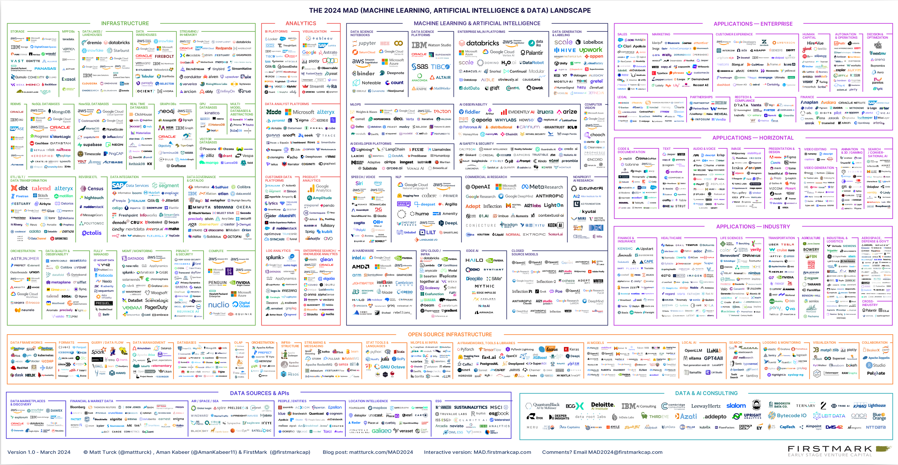
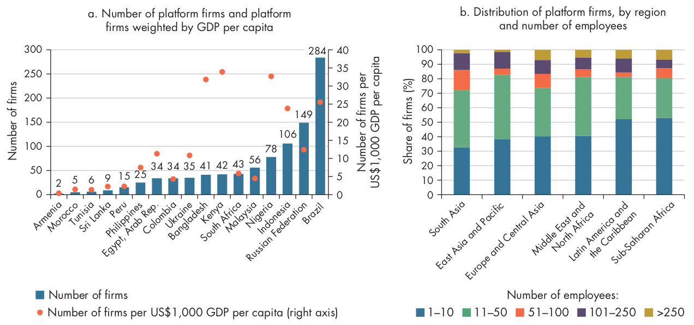
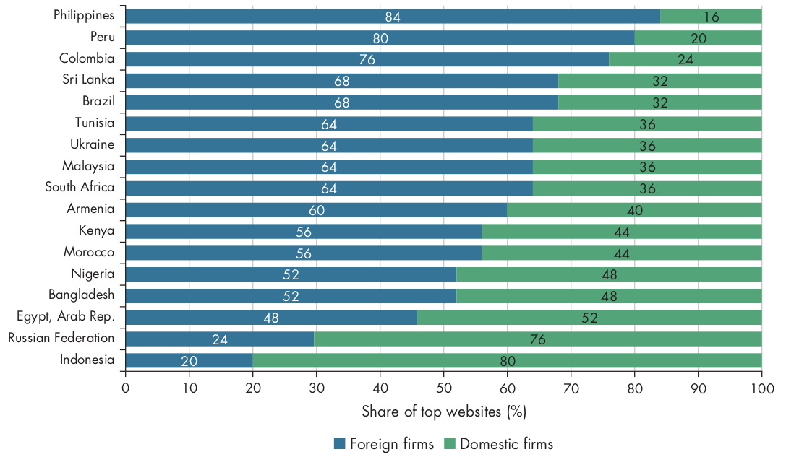
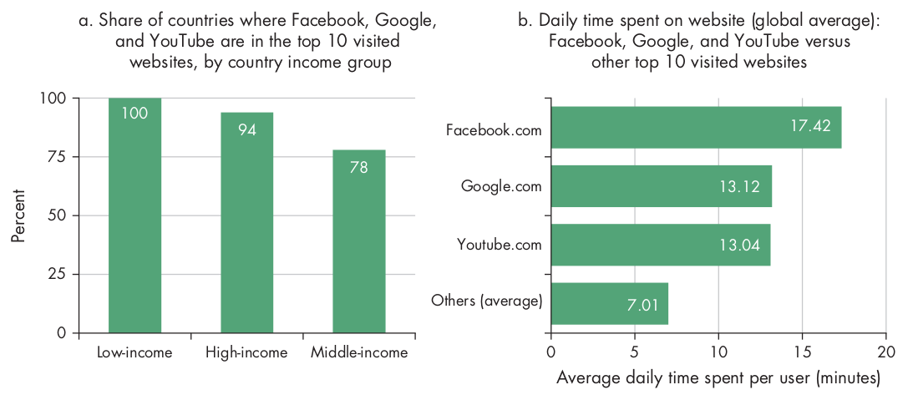
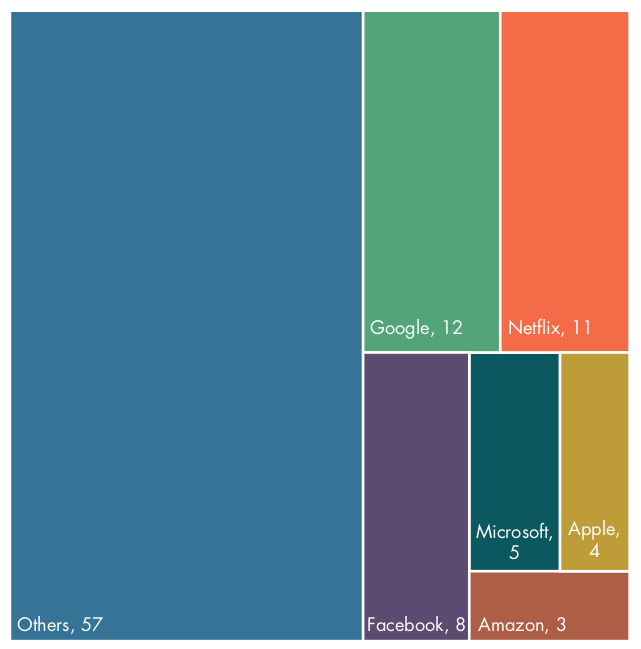
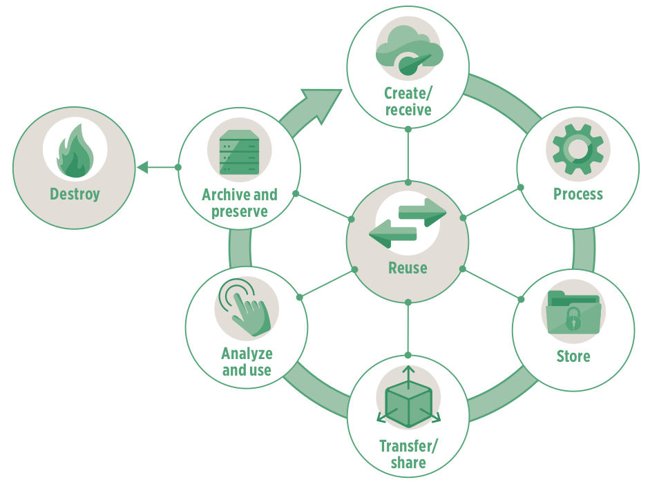
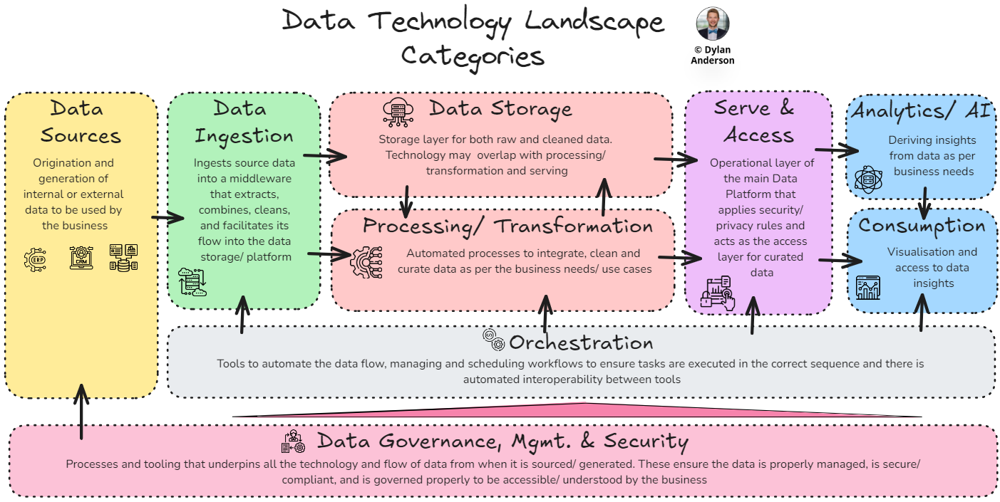

## {.center}

{fig-align="center"}

## Number of data tools and technologies {.center}

:::: {.columns}

::: {.column width="50%"}

* In 2012, there were about **139** apps/tools/platforms relevant to data.

* In 2023, there were about **1416**.

* By 2024, this number increased to **2000+**.

:::

::: {.column width="50%"}

{fig-align="center"}

:::

::::

## Technologies and methods that support data-driven decision-making

* Technology that supports data-intensive analytics: artificial intelligence, including machine learning

* Technology that collects data and actions insights from analytics: smart devices and devices connected through the Internet of Things (IoT)

* Technology that creates transparency and trust in data records: distributed ledger technology, including blockchain

## Platform firms in low and middle-income countries {.center}

{fig-align="center"}

## Domestic vs Foreign-based firms {.center}

{fig-align="center"}

## Users spend more time on Facebook, Google, and YouTube {.center}

{fig-align="center"}

## Internet traffic in low and middle income countries {.center}

{fig-align="center"}

## Data lifecycle {.center}

{fig-align="center"}

## Data technology landscape {.center}

{fig-align="center"}

