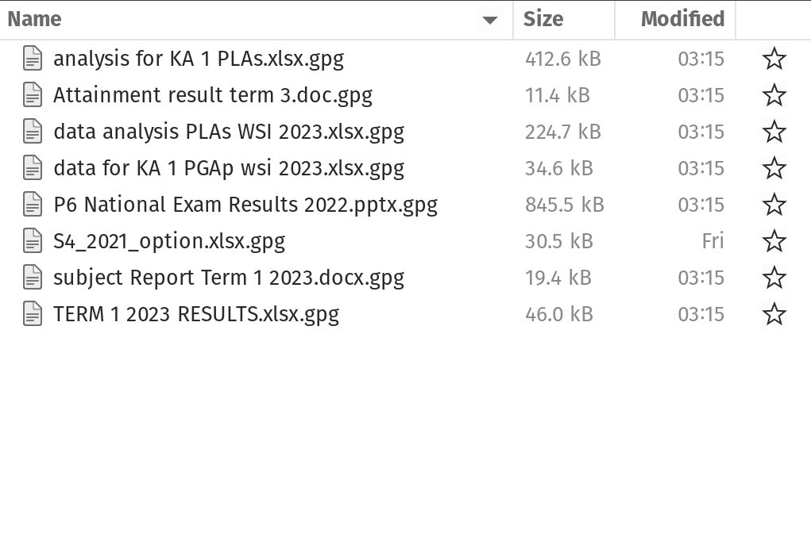

## Outline

* Data protection and privacy
* Organising data

## Data protection and privacy {.center background-color="#002147"}

## Principles

* lawfulness, fairness, and transparency;
* purpose limitation;
* data minimisation;
* accuracy;
* storage limitation;
* integrity and confidentiality; and
* accountability.

## Lawfulness, Fairness, and Transparency

* There should be a legal basis for collecting and using personal data (_lawfulness_)

* Handling personal data in ways that people would reasonably expect, and not using it in ways that cause them unjustified harm (_fairness_)

* Requires that any information and communication relating to the processing of personal data be easily accessible and easy to understand, and that clear and plain language be used (_transparency_)

## Purpose limitation

* Personal data should only be collected for _specified_, _explicit_, and _legitimate_ purposes and not further processed in a manner that is incompatible with those purposes.

* specific purposes for which personal data are processed should be _explicit_ and _legitimate_ and determined at the time of the collection of the personal data.

## Data minimisation

* Processing of personal data must be adequate, relevant, and limited to what is necessary in relation to the purposes for which they are processed. 

* Personal data should be processed only if the purpose of the processing could not reasonably be fulfilled by other means. 

* This is linked to the principle of **Storage limitation**

## Accuracy

* Ensure that personal data are accurate and, where necessary, kept up to date; taking every reasonable step to ensure that personal data that are inaccurate, having regard to the purposes for which they are processed, are erased or rectified without delay. 

* Accurately record information collected or receive and the source of that information.

## Storage limitation

* Personal data should only be kept in a form which permits identification of data subjects for as long as is necessary for the purposes for which the personal data are processed. 

* In order to ensure that the personal data are not kept longer than necessary, time limits should be established by the controller for erasure or for a periodic review.

## Integrity and confidentiality

* Protection against unauthorised or unlawful access to or use of personal data and the equipment used for the processing and against accidental loss, destruction or damage, using appropriate technical or organisational measures.

## Accountability

* Take responsibility for the processing of personal data and how they comply with the above principles

* Demonstrate (through appropriate records and measures) compliance

## Data security

* The practice of protecting digital information from unauthorised access, use, disclosure, disruption, modification, or destruction.

* Encompasses various measures and techniques to ensure the confidentiality, integrity, and availability of data throughout its lifecycle. 

* Includes securing physical hardware, software, storage devices, and user devices, as well as implementing access controls, policies, and procedures.

## Layers of data security

* Personal/individual layer - us as individuals responsible for the security of our own personal information and any other information that we own or are responsible for.

## Layers of data security

* Institutional layer

    * institutions responsible for the security of the personal information of its own employees and/or members/affiliates
    * institutions responsible for the security of the personal information of others from whom they collect information from as part of the service they render.
    * institutions responsible for the security of other types of information that they own or are responsible for

## Types of data security

* Encryption

* Data erasure

* Data masking

* Data resiliency

## Encryption

* Process of using an algorithm to transform normal text characters into an unreadable format

* Uses encryption keys that scramble data so that only authorised users can read it. 

* File and database encryption software serve as a final line of defense for sensitive information

## Data erasure

Uses software to completely overwrite data on any storage device, making it more secure than standard data wiping. It verifies that the data is unrecoverable.

## Data masking

* Replacing sensitive data with fictional yet realistic personally identifiable information (PII) where necessary so that development can occur in environments that are compliant.

* By masking data, organisations can allow teams to develop applications or train people that use real data.

## Data resiliency

* Resiliency depends on how well an organisation endures or recovers from any type of failure that affect data availability. 

* Speed of recovery is critical to minimise impact.

## Question

* How do you secure your personal information and any other sensitive or private information that you own?

* How does your institution (employer and/or organisation/association) secure the personal information of their employees/members and any other sensitive or private information that they own?

## Practical exercises on personal data security

* All about passwords

* Using two-factor authentication (2FA)

* Performing encryption

## Exercise 1: password management {.center background-color="#002147"}

Describe your password creation and password storage practices?

## Exercise 2: spy games with encryption {.center background-color="#002147"}

## Organising data {.center background-color="#002147"}

## Mindset {.center}

As our skills as data analysts grow, the surrounding systems and infrastructure become crucial for ensuring the reproducibility and long-term preservation of our work. However, we often lack formal training or mentorship in managing such systems, leading us to either get lost amidst this technology or that we begin to explore these possibilities ourselves.

## Mindset {.center}

* With this short course in general and this second week specifically, we hope to help you gracefully fall into this gap.

* Don’t fret over past mistakes, but raise the bar for new work. Small but meaningful incremental changes add up over time, transforming your **data quality of life**.

## Livestock not pets {.center}

:::: {.columns}

::: {.column width="50%"}

### Pets

{align="center"}

:::

::: {.column width="50%"}

### Livestock

{align="center"}

:::

::::

::: {.notes}

Think of your data processes as livestock and not pets.

Livestock is managed in herds and there is little fuss when individuals are lost or must be sacrificed. A pet, on the other hand, is unique and precious.

This is one of the limitations of spreadsheets in relation to creating a holistic data workflow. The tool combines the data, the code/steps, and the interface all in one software with an emphasis on just showing the end product/output to the user and the code/steps component hidden away. 

:::

## Project-oriented workflow {.center}

Organise work into projects.

## File system discipline

* Put all the files related to a single project in a designated folder.
* This applies to data, code, figures, notes, etc.
* Depending on project complexity, you might enforce further organization into subfolders.

## File naming {.center}

File organisation and naming are powerful weapons against chaos.

## Three principles for file names

:::: {.columns}

::: {.column width="70%"}

:::

::: {.column width="30%"}

* machine-readable

* human-readable

* plays well with default ordering

:::

::::

## Machine-readable

* avoid spaces, punctuation, accented, characters, case sensitivity.

* deliberate use of delimiters/space-holders - `"_"` or `"-"`

     * general rule is that `"_"` to delimit units of metadata while `"-"` to delimit words so that they are more readable.

## Machine-readable

* easy to search for files later
* easy to narrow file lists based on names
* easy to extract information from file names

## Human-readable

* name contains info on content.
* use the concept of a **slug** used in URLs.
* easy to figure out what something is based on its name

## Plays well with default ordering

* put something numeric first
* use ISO 8601 standard for dates
* add leading zeros to numbers

## Best practices for file naming and organisation

* easy to implement now
* payoffs accumulate as your skills evolve and projects get more complex

## Exercise {.center background-color="#002147"}

Within the project and the corresponding datasets provided within, create a project-based structure for these files and organise them based on what we have discussed.
