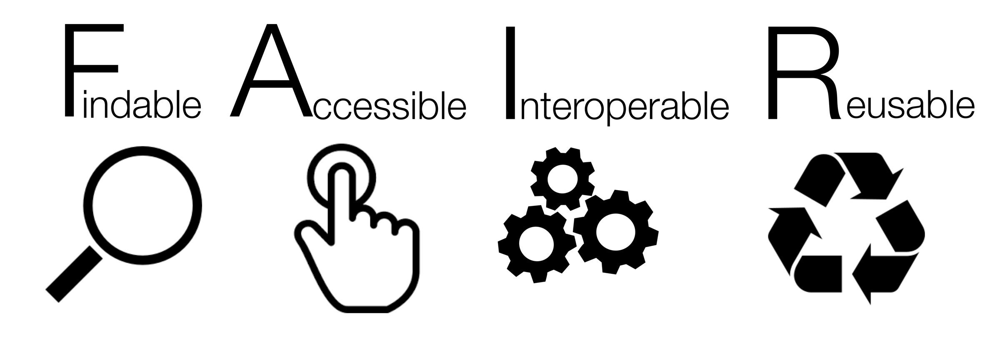

## Where we have been {.center}

* Across this course we have learned to **collect**, **structure**, **clean**, **store**, **analyse**, and **govern** data.

* For all of that effort to pay off, our data must be able to **outlive the moment it was created** so that it can be found, understood, and reused by others (and by our future selves).

::: {.notes}

This is the final session of the course. Frame FAIR as the natural conclusion of everything that came before. Every good habit we have built &mdash; tidy data, data dictionaries, consistent naming, plain-text storage, backups, data governance &mdash; is in service of data that can be trusted and reused. FAIR gives us a shared vocabulary and a checklist for that goal.

:::

## Outline

1. Why data reuse matters

2. What FAIR means

3. **F**indable, **A**ccessible, **I**nteroperable, **R**eusable

4. FAIR is not the same as Open

5. Making your own data more FAIR

6. FAIR in the context of this course

## Why does this matter?

* Most data is collected once, used once, and then **lost** either on a laptop, in an email attachment, in a folder no one can find.

* Decision makers repeatedly re-collect data that already exists because they cannot **find**, **access**, or **understand** what was gathered before.

* Data that cannot be reused is a wasted investment.

::: {.notes}

Ask the group: how many datasets have you collected that you could not locate or re-open a year later? How many times has your organisation paid to collect something that likely already existed somewhere? This is the everyday cost of non-FAIR data.

:::

## The goal: reuse by humans **and** machines {.center}

* The volume of data is growing far faster than any team of people can read, catalogue, and connect by hand.

* The FAIR principles were written so that **computers** can help us find and combine data with as little human effort as possible.

::: {.notes}

A key and often missed point: FAIR is explicitly about machine-actionability. Humans have always been able to muddle through with poorly organised data. The scale of modern data means we increasingly need machines to do the finding and linking for us, and machines are far less forgiving of inconsistency than humans are. This is exactly why the tidy-data and consistent-naming habits from earlier in the course matter.

:::

## What is FAIR?

* A set of guiding principles published in **2016** by a broad group of researchers, publishers, and funders (Wilkinson *et al.*, *Scientific Data*).

* Now stewarded by the **GO FAIR** initiative.

* FAIR describes four qualities that make data a lasting, reusable asset:

::: {.notes}

The foundational reference is Wilkinson MD, et al. (2016) "The FAIR Guiding Principles for scientific data management and stewardship", Scientific Data 3:160018. GO FAIR (go-fair.org) is the international body that maintains and promotes the principles today. FAIR started in the research world but has been widely adopted across government, health, and the private sector.

:::

## FAIR {.center}

* **F**indable

* **A**ccessible

* **I**nteroperable

* **R**eusable

::: {.notes}

Walk through the acronym at a high level before going deep. A one-line gloss for each: Findable = can someone (or something) locate it? Accessible = once found, can they retrieve it? Interoperable = does it speak a common language so it can be combined with other data? Reusable = is it described well enough to be trusted and used again? Then we take each in turn.

:::

## FAIR at a glance {.center}

{fig-align="center"}

::: {.aside}
Infographic by SangyaPundir, [CC BY-SA 4.0](https://creativecommons.org/licenses/by-sa/4.0){target="_blank"}, via [Wikimedia Commons](https://commons.wikimedia.org/wiki/File:FAIR_data_principles.jpg){target="_blank"}.
:::

::: {.notes}

Alternative overview slide (option 2 of 2). This is the widely recognised FAIR icon set: magnifying glass (Findable), pointing hand (Accessible), interlocking gears (Interoperable), recycling symbol (Reusable). Cleaner and more memorable than the diagram, but conveys less structure. The attribution is required under the CC BY-SA licence &mdash; keep the citation line if you use this slide. Choose this or the mermaid diagram on the previous slide.

:::

## The unsung hero: metadata {.center}

* **Metadata** is data *about* data &mdash; the who, what, when, where, why, and how of a dataset.

* Notice that most of the FAIR principles refer to **(meta)data**. Good metadata is what makes data findable, understandable, and reusable.

::: {.notes}

Emphasise this early because it recurs throughout. The notation "(meta)data" in the principles means "metadata and, where relevant, the data itself". A dataset can remain valuable long after the raw data is gone, purely because its metadata survives. The data dictionary we built earlier in the course is a concrete, familiar example of metadata.

:::

# Findable {background-color="#002147"}

## Findable

*If you cannot find it, nothing else matters.*

**F1.** (Meta)data are assigned a globally unique and persistent identifier.

**F2.** Data are described with rich metadata.

**F3.** Metadata clearly and explicitly include the identifier of the data they describe.

**F4.** (Meta)data are registered or indexed in a searchable resource.

::: {.notes}

Findability is the entry point. A globally unique and persistent identifier (like a DOI) is one that will not change and will not be reused for something else &mdash; unlike a file path or a link that breaks when a folder is reorganised. Rich metadata (F2) is what lets search engines and catalogues surface the right dataset. F3 makes sure the metadata record actually points back to the data it describes. F4 means the dataset lives somewhere it can be searched &mdash; a catalogue, registry, or repository &mdash; not buried on a personal drive.

:::

## Findable in plain terms

* Give every dataset a **permanent, unique name or identifier** (e.g. a DOI).

* Describe it richly: title, authors, date, geography, variables, methods.

* Put it somewhere **searchable** such as a data catalogue or repository, not a personal folder.

::: {.notes}

Translate the formal principles into actions your audience can take. A DOI (Digital Object Identifier) is the most common persistent identifier for datasets; services like Zenodo or Figshare will mint one for free. The richer the metadata, the more likely someone finds the data when they need it.

:::

# Accessible {background-color="#002147"}

## Accessible

*Once found, how do you get it?*

**A1.** (Meta)data are retrievable by their identifier using a standardised communications protocol.

&nbsp;&nbsp;&nbsp;&nbsp;**A1.1.** The protocol is open, free, and universally implementable.

&nbsp;&nbsp;&nbsp;&nbsp;**A1.2.** The protocol allows for authentication and authorisation, where necessary.

**A2.** Metadata are accessible, even when the data are no longer available.

::: {.notes}

Accessible does NOT mean "open to everyone" &mdash; this is the most common misconception. It means that the rules for access are clear and can be acted upon. A standardised protocol (like HTTP) means anyone with a standard tool can retrieve the data. A1.1 favours open, free protocols so no one is locked out by proprietary software. A1.2 explicitly allows for login, permissions, and consent procedures &mdash; essential for sensitive or personal data, which we covered in the data protection and governance sessions. A2 is powerful: even if the data itself is deleted or restricted, the metadata (the record that it existed, and how to request it) should live on.

:::

## Accessible in plain terms

* Use **standard, open ways** to retrieve data (a web link that works, not "email me for the file").

* Where data is sensitive, provide a **clear, documented process** for requesting access.

* Keep the **metadata alive** even if the data is retired or restricted.

::: {.notes}

Reinforce that access controls and FAIR are fully compatible. A dataset behind an authentication step is still FAIR if the process is clear and standardised. This connects directly to the data protection principles: personal and sensitive data can be FAIR and still be responsibly restricted.

:::

# Interoperable {background-color="#002147"}

## Interoperable

*Can it be combined with other data?*

**I1.** (Meta)data use a formal, accessible, shared, and broadly applicable language for knowledge representation.

**I2.** (Meta)data use vocabularies that follow FAIR principles.

**I3.** (Meta)data include qualified references to other (meta)data.

::: {.notes}

Interoperability is about data being able to "talk to" other data and systems without a human manually reconciling everything. I1: use common, well-defined formats and languages rather than idiosyncratic ones. I2: use shared, standard vocabularies &mdash; for example, an agreed list of country codes, disease codes (ICD), or units &mdash; so that "F", "female", and "Female" don't fragment your data. I3: link your data to related data with meaningful, described relationships (this record is derived from that one; this variable is defined in that standard).

:::

## Interoperable in plain terms

* Save data in **open, common formats** (CSV, not a proprietary binary).

* Use **agreed vocabularies and codes** such as standard country codes, units, category labels.

* **Link** related datasets and definitions explicitly.

::: {.notes}

This is where the earlier lessons pay off directly. "Be consistent", "put one thing in a cell", "save as plain text", and building a data dictionary are all interoperability practices. Standard vocabularies are the difference between five spellings of the same category and one machine-readable code.

:::

## This should sound familiar {.center}

:::: {.columns}

::: {.column width="50%"}

**From our spreadsheets session**

* Be consistent

* One thing per cell

* Dates as `YYYY-MM-DD`

* Save as plain text

* Create a data dictionary

:::

::: {.column width="50%"}

**FAIR equivalent**

* Interoperable vocabularies (I2)

* Machine-readable data

* Shared standard (ISO 8601)

* Open format (A1.1, I1)

* Rich metadata (F2, R1)

:::

::::

::: {.notes}

Make the through-line explicit. The tidy-data and good-spreadsheet habits we practised were not arbitrary rules &mdash; they are the ground-level, practical implementation of FAIR. Learners have already been doing FAIR without the label.

:::

# Reusable {background-color="#002147"}

## Reusable

*The ultimate goal &mdash; can it be trusted and used again?*

**R1.** (Meta)data are richly described with a plurality of accurate and relevant attributes.

&nbsp;&nbsp;&nbsp;&nbsp;**R1.1.** (Meta)data are released with a clear and accessible data usage licence.

&nbsp;&nbsp;&nbsp;&nbsp;**R1.2.** (Meta)data are associated with detailed provenance.

&nbsp;&nbsp;&nbsp;&nbsp;**R1.3.** (Meta)data meet domain-relevant community standards.

::: {.notes}

Reusability is the whole point &mdash; the first three qualities exist to serve it. R1: describe the data richly enough that someone else can judge whether it fits their purpose. R1.1: a licence tells people what they are legally allowed to do with the data; without one, cautious users assume they can do nothing. R1.2: provenance is the data's origin story &mdash; where it came from, how it was processed, by whom &mdash; which is the basis of trust. R1.3: following the standards your field already uses means your data slots straight into existing workflows.

:::

## Reusable in plain terms

* Document **how, when, why, and by whom** the data was produced (provenance).

* Attach a **clear licence** so others know what they may do with it.

* Follow the **standards of your sector** so the data fits existing workflows.

::: {.notes}

Provenance connects back to the data workflow and governance sessions: version control, documented processing steps, and clear ownership all feed reusability. A licence is not a bureaucratic afterthought &mdash; without one, well-meaning users are legally stuck.

:::

# FAIR is not the same as Open {background-color="#002147"}

## FAIR is not the same as Open

* **Open data** = free for anyone to use, with no or minimal restriction.

* **FAIR data** = well-described, well-managed, and reusable *under clearly stated conditions* which may include restrictions.

::: {.callout-note appearance="simple"}

Data can be **FAIR without being fully open**. Sensitive health, financial, or personal data can and should be FAIR while remaining protected.

:::

::: {.notes}

This is worth dwelling on for a decision-making audience. Much of the data you work with is personal or sensitive and cannot be made openly available &mdash; and FAIR does not ask you to. FAIR asks that the data be findable, that access rules be clear, that formats be standard, and that reuse conditions be documented. The GO FAIR slogan is "as open as possible, as closed as necessary." This resolves the apparent tension with the data protection principles we covered earlier.

:::

## As open as possible, as closed as necessary {.center}

::: {.notes}

Leave this on screen as the memorable one-line summary of the FAIR-vs-Open distinction. It captures the balance decision makers must strike between transparency and protection.

:::

# Making your data more FAIR {background-color="#002147"}

## A practical starting checklist

1. **Name it uniquely** , e.g., a persistent identifier, not just a filename.

2. **Describe it** with rich metadata and a data dictionary.

3. **Store it somewhere searchable** such as a catalogue or repository.

4. **Use open formats and standard codes** such as CSV, ISO dates, agreed vocabularies.

5. **State the access rules** such as who can use it and how.

6. **Add a licence and record its provenance.**

::: {.notes}

Frame this as a checklist learners can apply to their own next dataset. It is deliberately practical and low-cost &mdash; most items require good habits rather than new budget. Point out that they already have the skills for most of these from earlier sessions.

:::

## FAIR is a spectrum, not a badge

* FAIR is not pass/fail; datasets are **more or less** FAIR.

* You do not need to do everything at once. **Any** improvement makes data more reusable.

* Start with the cheapest, highest-impact steps: **good metadata** and **consistent, open formats**.

::: {.notes}

Relieve any sense that FAIR is an all-or-nothing burden. Progress is incremental and cumulative. Even adding a README and a data dictionary to an existing folder measurably improves findability and reusability. The goal is direction of travel, not perfection.

:::

## FAIR strengthens data governance {.center}

* FAIR is the **practical, dataset-level expression** of the data governance principles we discussed:

* accountability, documentation, clear access rules, and long-term stewardship applied to every dataset you hold.

::: {.notes}

Tie FAIR back to the data governance session. Governance sets the organisational policy; FAIR is what "good" looks like at the level of an individual dataset. An organisation with strong governance but non-FAIR datasets has policy without practice.

:::

## Summary

* FAIR = **F**indable, **A**ccessible, **I**nteroperable, **R**eusable.

* It exists so data can be reused by **humans and machines**, long after collection.

* **Metadata** is what carries most of the FAIR qualities.

* FAIR is **not** the same as Open &mdash; sensitive data can be FAIR and protected.

* Almost everything in this course &mdash; tidy data, dictionaries, consistent naming, governance &mdash; has been building toward FAIR.

::: {.notes}

Close the loop on the whole course. FAIR is a fitting final topic because it names and unifies the purpose behind every practical habit we have built. Leave learners with the sense that they now have both the skills and the framework to make their organisation's data a lasting asset.

:::

## Exercise {.center}

Take **one dataset** your team currently holds. Score it against the FAIR checklist:

which principles does it already meet, and what are the **two cheapest changes** that would make it more FAIR?

::: {.notes}

A concrete closing activity. In small groups, have learners pick a real dataset, walk it through the six-step checklist, and identify two low-cost, high-impact improvements. Share back to the room. This turns FAIR from an abstract principle into an action plan they leave the course with.

:::

